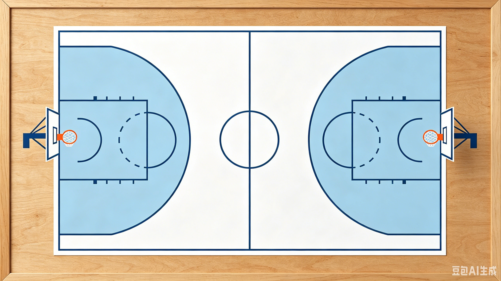

# 🏀 篮球战术板

一个纯前端实现的交互式篮球战术板，支持球员拖动、多步骤战术编排、轨迹记录、动画播放、视频导出和历史记录存取。



## ✨ 功能特性

- **球员与篮球**：5 名红队球员 + 5 名黄队球员 + 1 个篮球，均可拖动
- **初始摆放阶段**：独立的初始站位设定，不产生轨迹
- **多步骤战术**：可创建多个战术步骤，每个步骤内拖动多名球员/篮球
- **轨迹记录**：完整记录拖动路径（曲线），带箭头指示
- **三级重置**：撤销单次拖动 / 重置当前步骤 / 重置全部
- **战术回放**：按步骤顺序播放动画，支持 0.25x ~ 1x 速度调节
- **步骤注释**：每个步骤可添加文字注释，播放时同步显示
- **保存视频**：导出战术动画为视频文件
- **历史记录**：保存/加载战术数据（JSON 格式）
- **PWA 支持**：可安装到手机桌面，离线可用

---

## 📖 使用说明

### 1. 初始摆放

打开页面后进入**初始摆放**阶段，拖动球员和篮球到起始位置，点击 **"✅ 完成初始摆放"**。

### 2. 编排战术步骤

- 在当前步骤中拖动球员/篮球，会自动记录移动轨迹
- 点击 **"✅ 完成步骤"** 保存当前步骤并进入下一步
- 点击 **"⬅ 上一步"** 可回到之前的步骤查看或修改
- 在步骤注释框中输入文字，播放时会同步显示

### 3. 播放与导出

- **"▶ 播放全部"**：在页面内预览战术动画
- **"📹 保存视频"**：导出战术动画为视频文件
- **速度滑块**：调节播放速度（0.25x ~ 1x，默认 0.5x）

### 4. 撤销与重置

- **"↩ 撤销拖动"**：撤销最近一次拖动（或取消当前正在进行的拖动）
- **"🔄 重置步骤"**：清空当前步骤的所有轨迹
- **"🗑 重置全部"**：清空所有步骤，回到初始状态

### 5. 保存/加载战术

- **"💾 保存战术"**：将所有数据导出为 JSON 文件
- **"📂 加载战术"**：导入之前保存的 JSON 文件，恢复完整战术

---

## 🚀 三种使用方式

### 方式一：在线访问（推荐分享）

部署到 **GitHub Pages**，获得免费链接，无需买域名、无需租服务器。

#### 部署步骤

1. **创建 GitHub 仓库**
   - 登录 [github.com](https://github.com)，新建仓库（如 `basketball-tactics`）
   - 不要勾选 "Initialize this repository with a README"

2. **推送代码**
   ```bash
   cd 你的项目文件夹
   git init
   git add .
   git commit -m "init"
   git branch -M main
   git remote add origin https://github.com/你的用户名/basketball-tactics.git
   git push -u origin main
   ```

3. **开启 GitHub Pages**
   - 进入仓库 → Settings → Pages
   - Source 选择 "Deploy from a branch"，Branch 选 `main` / `root`
   - 保存后等待 1~2 分钟

4. **获得链接**
   ```
   https://你的用户名.github.io/basketball-tactics/
   ```
   把链接发给朋友，对方点击就能用。

### 方式二：安装到手机桌面（像 App 一样）

本页面已支持 PWA（渐进式 Web 应用）。

#### Android（Chrome / Edge）
1. 用浏览器打开链接
2. 点击菜单 → **"添加到主屏幕"**（或 **"安装应用"**）
3. 手机桌面会出现篮球图标，点击全屏打开，体验与原生 App 一致

#### iOS（Safari）
1. 用 Safari 打开链接
2. 点击底部分享按钮 → **"添加到主屏幕"**
3. 桌面生成图标，支持离线使用

> PWA 首次加载后会自动缓存所有资源，之后**无需网络也能打开**。

### 方式三：打包成 APK（Android 安装包）

> **为什么需要链接？**
> 
> PWA Builder 等在线工具需要读取你的网页内容才能打包。如果你**不想用链接、不想部署到网上**，那就只能在**本地构建 APK**（见方案 B）。

#### 方案 A：PWA Builder（在线打包，需要链接）

[PWA Builder](https://www.pwabuilder.com/) 是微软开发的一个在线工具，你把网页链接给它，它自动帮你生成 Android APK、iOS 安装包、Windows 应用等。本质上是给你的网页套一个原生壳子。

1. 先按**方式一**部署到 GitHub Pages，获得链接
2. 访问 [PWA Builder](https://www.pwabuilder.com/)
3. 输入你的 GitHub Pages 链接，点击 "Start"
4. 选择 **"Android"** → 下载 APK
5. 把 APK 发给朋友直接安装

---

## 📦 APK 本地打包教程（不需要链接）

如果你**不想把网页放到网上**，可以用 Capacitor 在本地打包。所有网页文件都会被打包进 APK 里，完全离线运行，不需要任何网址。

### 准备工作（只需做一次）

1. **安装 Node.js**
   - 访问 [nodejs.org](https://nodejs.org/)，下载 LTS 版本
   - 安装包一路点击下一步即可

2. **安装 Android Studio**
   - 访问 [developer.android.com/studio](https://developer.android.com/studio)
   - 下载并安装
   - 第一次打开时让它自动下载 SDK（出现提示时点击 "OK" 或 "Next"）

### 第一次构建 APK

```bash
# 进入项目目录
cd 你的项目文件夹

# 1. 安装依赖（package.json 已配置好）
npm install

# 2. 生成 Android 项目（只需要执行一次）
npx cap add android

# 3. 同步网页资源到 Android 项目
npx cap sync

# 4. 打开 Android Studio
npx cap open android
```

在 Android Studio 中：
1. 等待底部状态栏的 **Gradle 同步**完成（出现 "Sync finished"）
2. 菜单栏选择 **Build → Build Bundle(s) / APK(s) → Build APK(s)**
3. 生成的 APK 在 `android/app/build/outputs/apk/debug/app-debug.apk`

把 `app-debug.apk` 发给朋友，直接安装即可。

### 后续修改后重新打包

如果你修改了 `index.html`、战术数据或其他文件，需要重新生成 APK：

```bash
# 同步更新后的文件
npx cap sync

# 重新构建 APK（不需要打开 Android Studio）
cd android && ./gradlew assembleDebug
```

新的 APK 仍在 `android/app/build/outputs/apk/debug/app-debug.apk`。

### npm install 出现警告怎么办？

`npm install` 时可能会看到类似这样的提示：

```
npm WARN deprecated glob@9.3.5: Old versions of glob are not supported...
2 high severity vulnerabilities
```

**这些可以忽略**。它们是 Capacitor 依赖的间接库的旧版本警告，不会影响你的战术板程序。如果介意，可以运行：

```bash
npm audit fix
```

---

## 🎥 视频导出说明

| 浏览器 | 导出格式 |
|--------|----------|
| Safari | MP4 |
| Chrome / Edge / Firefox | WebM (VP8) |

- WebM 格式可用 Chrome、Edge、VLC（3.0.20+）、PotPlayer 等播放器打开
- 如需在其他设备上使用 MP4，可用格式工厂、HandBrake 等工具转换，或通过 Safari 浏览器导出

---

## ⚠️ 常见问题

**Q：双击 HTML 文件打开时无法保存视频？**  
A：浏览器禁止 `file://` 协议下的视频录制。请通过 HTTP 服务器或 GitHub Pages 打开。

**Q：VLC 打不开导出的 WebM 视频？**  
A：请升级 VLC 到 3.0.20 或更高版本。程序已使用 VP8 编码并修复了时长元数据。

**Q：iOS 上能安装吗？**  
A：可以。Safari 打开链接 → 分享 → "添加到主屏幕"。iOS 上导出视频为 MP4 格式，兼容性最好。

**Q：PWA 安装后还需要网络吗？**  
A：首次打开需要联网加载资源，之后自动缓存，可离线使用。

---

## 📁 文件结构

```
.
├── index.html              # 主程序（单页应用）
├── basketball_court.png    # 篮球场背景图
├── manifest.json           # PWA 应用配置
├── service-worker.js       # PWA 离线缓存
├── icon-192.png            # PWA 图标 192x192
├── icon-512.png            # PWA 图标 512x512
├── package.json            # Node.js 依赖配置（Capacitor 打包用）
├── capacitor.config.json   # Capacitor 打包配置
└── README.md               # 本说明文件
```

## 🛠 技术栈

- 纯 HTML / CSS / JavaScript
- Canvas 2D 渲染（播放动画）
- SVG 轨迹绘制（编辑模式）
- MediaRecorder API（视频录制）
- Service Worker（PWA 离线支持）
- Capacitor（打包原生 APK）

## 📄 开源协议

MIT License
