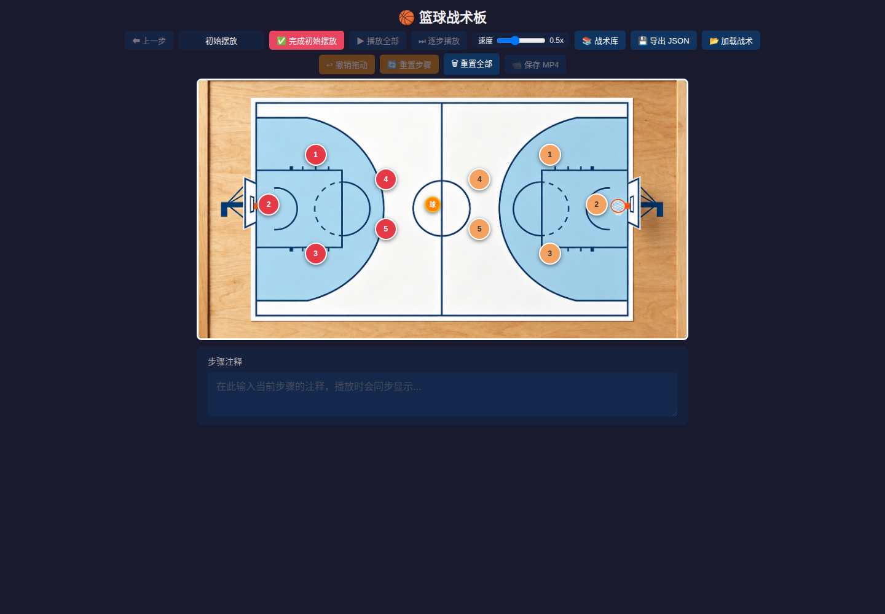
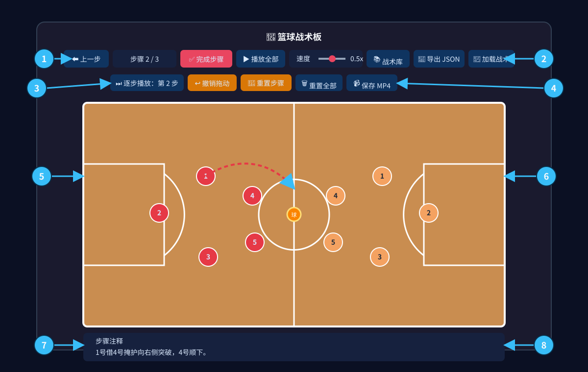
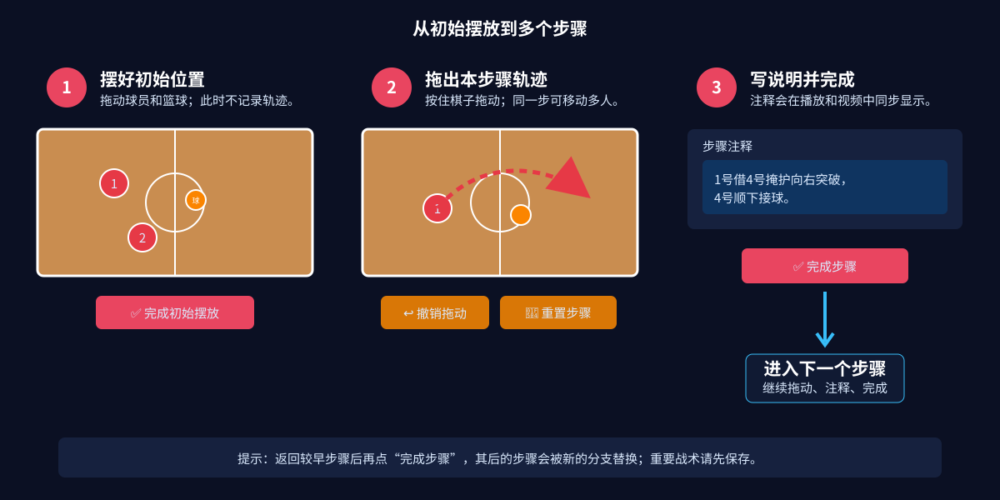
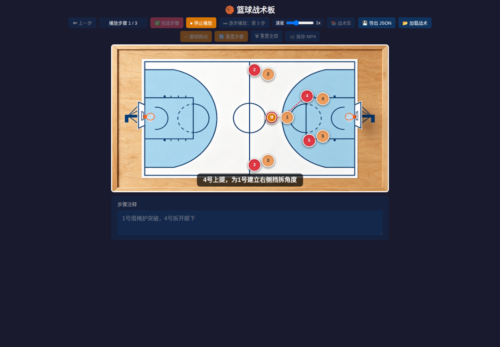
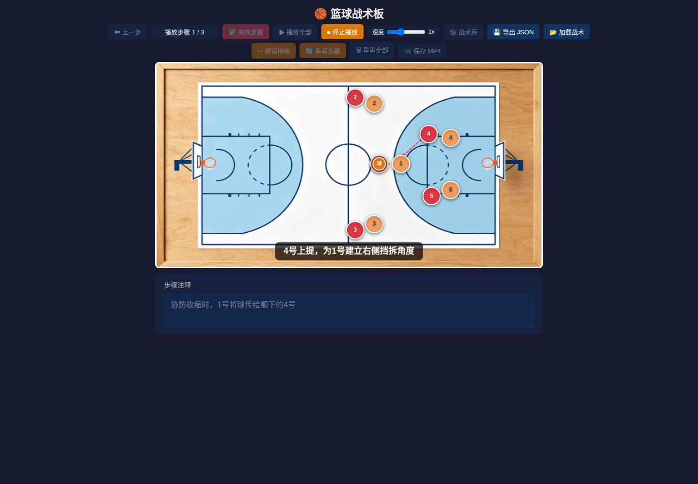
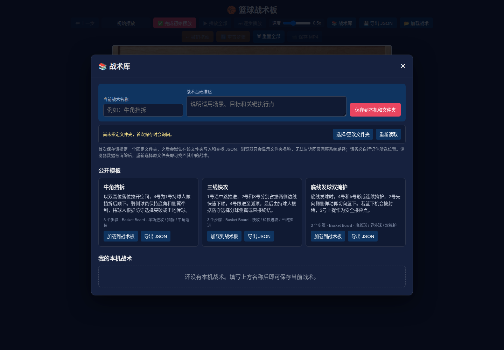
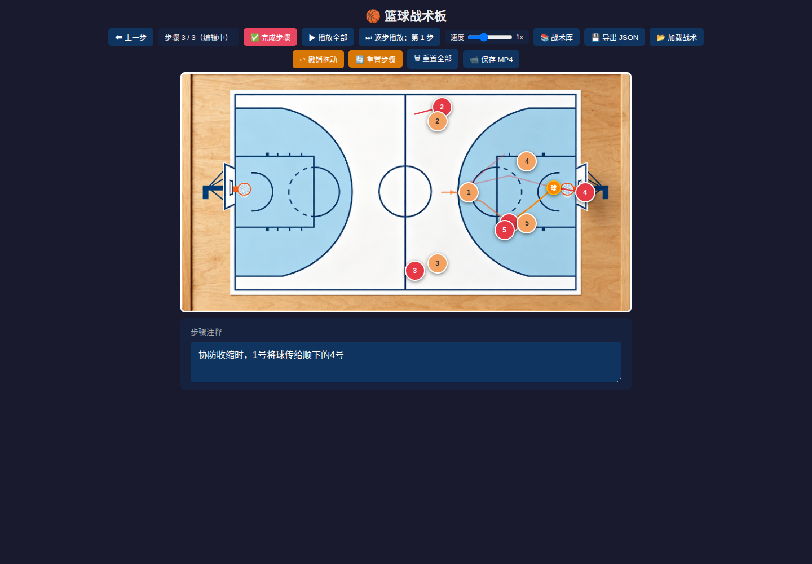
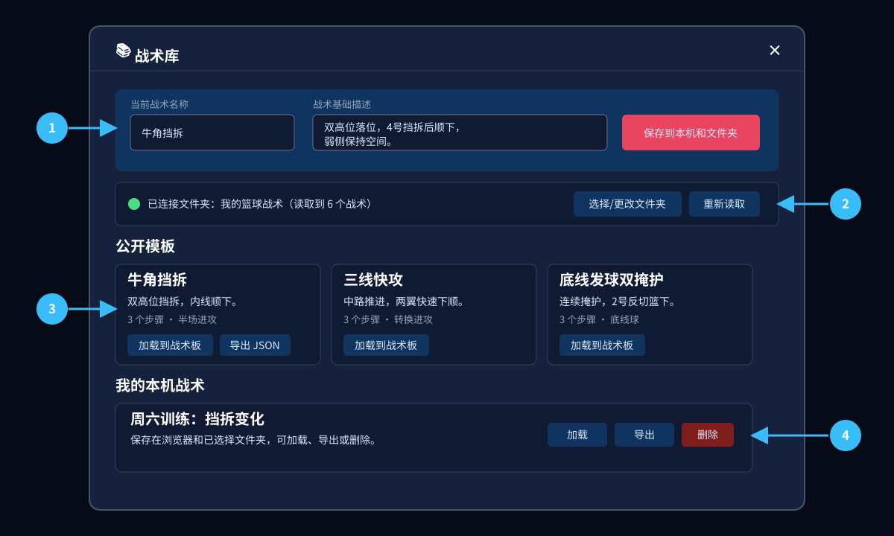
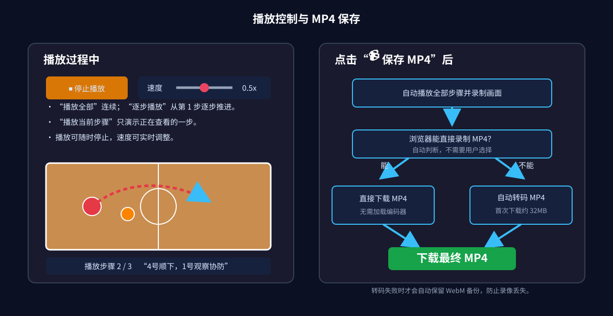

# 篮球战术板使用说明

篮球战术板可以在浏览器中绘制多步骤跑位、播放战术、管理战术文件并保存讲解视频。它不需要注册账号，也不会把你的自定义战术上传到服务器。

在线使用：<https://bflyer.github.io/basket-board/>

> **先记住两件事**
>
> 1. 保存自定义战术时，请选择一个固定文件夹，并记住它在电脑上的位置。
> 2. 浏览器数据可能被清除，重要战术不要只保存在浏览器里；请保留文件夹中的 JSON 文件或另行导出备份。

## 1. 界面一览

页面分为三个区域：顶部操作栏、中间球场、底部步骤注释。红色和黄色圆点代表两队球员，橙色“球”代表篮球。

下面的标注图可以帮助你快速找到主要功能：

## 2. 第一次画战术

一个战术由“初始摆放”和若干“步骤”组成。

### 2.1 设置初始站位

1. 按住球员或篮球，将它拖到战术开始时的位置。
2. 依次摆好需要使用的球员和篮球。
3. 点击 **完成初始摆放**，进入步骤 1。

初始摆放阶段只记录起点，不显示跑位轨迹。

### 2.2 绘制跑位步骤

1. 在步骤 1 中，按住一名球员或篮球并沿路线拖动。
2. 松开后，页面会保存这一次移动并显示轨迹。
3. 同一步可以拖动多个球员，也可以让同一球员移动多次。
4. 在下方 **步骤注释** 中输入本步讲解，例如“4号上提，为1号建立右侧挡拆角度”。
5. 点击 **完成步骤**，进入下一步。
6. 重复以上操作，直到战术完成。

> **注意：**返回较早的步骤后，如果点击 **完成步骤** 并继续编辑，该步骤之后原有的后续步骤会被截断。重要战术建议先保存或导出 JSON 备份。

### 2.3 修改错误

- **撤销拖动**：删除当前步骤最后一次已完成的拖动，不影响更早的拖动。
- **重置步骤**：清除当前步骤的全部拖动，保留当前步骤的文字注释；操作前会要求确认。
- **上一步**：返回前一个步骤；从步骤 1 再返回一次会回到初始摆放。
- **重置全部**：清空初始摆放、所有步骤和注释，恢复新战术状态；操作前会要求确认。

## 3. 连续播放、逐步播放、调速和停止

只要至少有一个步骤包含移动或注释，**播放全部** 就会变为可用。

1. 点击 **播放全部**，战术从初始站位开始依次播放。
2. 拖动 **速度** 滑块，可以选择 `0.25x`、`0.5x`、`0.75x` 或 `1x`。
3. 播放过程中仍可修改速度，新速度立即生效。
4. 播放时按钮会变成 **停止播放**；点击它可以随时中断并回到编辑界面。
5. 有步骤注释时，播放画面会同步显示字幕。

### 逐步讲解

如果希望边讲边控制进度，使用 **逐步播放：第 1 步** 按钮：

1. 第一次点击只播放第 1 步，播放结束后停住。
2. 按钮随后变为 **逐步播放：第 2 步**；再次点击只播放第 2 步。
3. 依次播放完最后一步后，按钮重新回到 **逐步播放：第 1 步**。
4. 单步播放过程中，按钮会变成 **停止播放**，可以随时中断。
5. 单步播放同样支持在播放过程中实时调速。

如果中途修改了站位、轨迹或注释，逐步播放会从第 1 步重新开始，以免沿用已经失效的播放位置。

停止播放只会停止本次演示，不会删除已画的步骤。

## 4. 使用战术库

点击顶部 **战术库**，可以查看公开模板和当前浏览器中的自定义战术。

### 4.1 公开模板

当前内置了牛角挡拆、三线快攻和底线发球双掩护等测试模板。每张卡片包含基础描述、步骤数、作者和标签。

- 点击 **加载到战术板**：用该模板替换球场上的当前内容。
- 点击 **导出 JSON**：把该模板下载为独立文件。

加载模板会覆盖当前未保存内容，页面会先要求确认。载入后可以自由修改，也可以另存为自己的战术。

### 4.2 保存自定义战术

1. 在战术库上方填写 **当前战术名称**。
2. 填写 **战术基础描述**，说明适用场景、目标或关键执行点。
3. 点击 **保存到本机和文件夹**。
4. 第一次保存时，浏览器会要求选择一个文件夹。建议新建一个容易找到的文件夹，例如“篮球战术”。
5. 允许网页读写该文件夹，并记住它在电脑上的完整位置。

保存后会同时更新：

- 当前浏览器中的本地副本；
- 所选文件夹中的 `basket-board-*.json` 文件。

之后再次保存同一个已加载的本机战术，会更新原战术；新画的战术会建立新文件。

### 4.3 找回保存过的战术

- 再次打开页面时，浏览器会记住所选文件夹的名称。
- 如果状态提示需要授权，点击 **重新读取**，然后允许访问。
- 如果清除了浏览器数据，点击 **选择/更改文件夹**，重新选择原来的文件夹；其中符合命名规则的战术会重新出现在 **我的本机战术**。
- **选择/更改文件夹** 也可用于改用另一个战术目录。

浏览器出于隐私保护，只会把文件夹名称告诉网页，不能显示完整磁盘路径。因此页面无法替你找出当初选在了哪个位置。

### 4.4 不支持固定文件夹的浏览器

最新版 Chrome 和 Edge 对固定文件夹支持最好。Firefox、Safari、部分手机浏览器或隐私模式可能不允许网页持续访问指定文件夹。

遇到这种情况时，战术仍会保存在当前浏览器中，同时自动下载一份 JSON。请记住浏览器的下载目录并妥善备份该文件。

### 4.5 本机战术卡片

- **加载到战术板**：打开该战术继续查看或编辑。
- **导出 JSON**：额外下载一份备份，便于分享或转移电脑。
- **删除**：删除浏览器中的记录；若已连接固定文件夹，也会删除对应 JSON，且无法恢复。

## 5. 导入、导出和分享 JSON

### 导出当前战术

点击顶部 **导出 JSON**，浏览器会下载当前战术的完整文件，包括：

- 初始站位；
- 每一步的移动轨迹；
- 每一步的文字注释；
- 战术名称、基础描述、作者和标签等信息。

### 导入战术

1. 点击顶部 **加载战术**。
2. 选择一个战术 JSON 文件。
3. 加载成功后，球场会显示该战术的最后一步，可以用 **播放全部** 查看全过程。

导入会替换当前战术板内容。导入后如需长期保存，请放入本机战术库或再次导出。

### 分享给别人

把导出的 JSON 发给对方即可。对方不需要复制你的文件夹路径，只需在自己的页面中点击 **加载战术**。

公开模板需要由仓库维护者审核后发布。纯浏览器页面不能直接修改公共仓库，也不能在所有访客之间自动同步投稿；如希望战术进入公开模板，请把 JSON 交给维护者审核。

## 6. 保存 MP4 视频

战术至少包含一个可播放步骤后，点击 **保存 MP4**：

1. 页面会自动从头播放并录制战术。
2. 播放期间可以实时调整速度。
3. 如果不想继续，点击 **停止播放**；中断的录像不会作为完整视频保存。
4. 播放结束后，浏览器会自动下载 MP4。

### 为什么第一次保存可能较慢

不同浏览器提供的视频格式不同：

- 浏览器可以直接录制 MP4 时，页面直接下载 MP4。
- 浏览器只能录制 WebM 时，页面会自动在浏览器内转成兼容性更好的 MP4。

第一次需要转码时，浏览器要从本站加载约 32 MB 的视频编码器并存入缓存，因此速度取决于网络连接。它是网页使用的 WebAssembly 编码器，**电脑不需要安装 FFmpeg，也不需要配置环境变量**。以后通常会直接使用缓存，加载更快。

转码成功后只下载 MP4，临时 WebM 会被清理。如果转码失败，页面会自动下载 WebM 备份，避免整段录像丢失。

> 不要直接双击本地 `index.html` 使用 `file://` 地址录制。请使用在线地址，或通过 HTTP 服务打开页面。

## 7. 安装与离线使用

这是一个可安装的网页应用。使用最新版 Chrome 或 Edge 打开在线地址后，可以通过地址栏的安装图标，或浏览器菜单中的 **安装应用**/**添加到主屏幕** 完成安装；不同系统的文字略有差异。

安装后可以像普通应用一样从桌面或主屏幕启动。已经缓存的页面、球场和战术模板可离线使用。以下操作仍可能需要联网：

- 第一次打开尚未缓存的页面资源；
- 第一次加载视频转码器；
- 获取网站更新。

离线不影响读取已保存在当前浏览器中的战术；固定文件夹是否可访问取决于浏览器和系统授权。

## 8. 全部按钮速查

| 按钮或区域 | 作用 | 重要提醒 |
|---|---|---|
| 上一步 | 回到前一个步骤或初始摆放 | 回去修改后继续新增步骤可能截断后续步骤 |
| 完成初始摆放 | 固定起始站位并进入步骤 1 | 之后的拖动会成为跑位轨迹 |
| 完成步骤 | 保存当前步骤并新建下一步 | 末尾未编辑的空步骤不会播放；中间空步骤会形成停留画面 |
| 播放全部 / 停止播放 | 连续播放或随时中断整个战术 | 停止不会删除步骤 |
| 逐步播放：第 N 步 / 停止播放 | 每次只播放一步，下一次点击继续下一步 | 播完最后一步后回到第 1 步 |
| 速度 | 调整播放和录制速度 | 播放过程中也能调整 |
| 战术库 | 打开公开模板和本机战术 | 播放期间不能打开 |
| 导出 JSON | 下载当前战术文件 | 适合作为备份和分享 |
| 加载战术 | 从 JSON 文件导入战术 | 会替换当前内容 |
| 撤销拖动 | 删除当前步骤最后一次拖动 | 只影响当前步骤 |
| 重置步骤 | 清除当前步骤全部拖动 | 保留该步骤注释 |
| 重置全部 | 恢复全新的战术板 | 所有未保存内容都会丢失 |
| 保存 MP4 | 播放并录制完整战术 | 首次转码需要加载编码器 |
| 步骤注释 | 填写当前步骤的字幕和说明 | 最多 120 个字符 |
| 保存到本机和文件夹 | 保存有名称的自定义战术 | 务必记住所选目录 |
| 选择/更改文件夹 | 指定固定战术目录 | Chrome/Edge 支持最好 |
| 重新读取 | 重新授权并扫描已选目录 | 可用于恢复浏览器记录 |
| 关闭 × / Esc | 关闭战术库 | 不改变战术板内容 |

## 9. 常见问题

### “播放全部”或“保存 MP4”是灰色的

先完成初始摆放，并至少建立一个包含移动轨迹或文字注释的步骤。`file://` 打开页面时会禁用视频录制。

### 清除浏览器数据后，战术不见了

浏览器本地副本会随网站数据一起被删除。如果此前选择了固定文件夹，请进入战术库，点击 **选择/更改文件夹** 并重新选择原目录；也可以用 **加载战术** 导入备份 JSON。

### 战术库显示“已记住文件夹”，但没有读取

点击 **重新读取**，并在浏览器提示中重新允许访问。仍然失败时，使用 **选择/更改文件夹** 再选一次。

### 视频编码器一直是 0% 或加载失败

确认网络可以访问当前站点，刷新页面后重试；公司、校园或受限制网络可能会阻止大文件。也可以先在正常网络下成功加载一次，让浏览器完成缓存。请勿在隐私模式下依赖长期缓存。

### 最后一步播放完后为什么还需要一点时间

普通播放结束后会立即回到编辑状态；保存 MP4 时，播放结束后还需要停止录制并封装视频。如果浏览器不能直接生成 MP4，还会继续进行转码。这段时间不要关闭页面。

### 手机或内嵌浏览器功能不完整

建议改用最新版 Chrome、Edge、Firefox 或 Safari。微信等应用内置浏览器、旧版浏览器和部分 WebView 可能缺少文件夹访问、录制、WebAssembly 或文件下载能力。

### 我的战术会上传吗

不会。自定义战术保存在当前浏览器、你选择的文件夹或下载的 JSON 中。只有你主动把 JSON 发给别人或提交给维护者时，它才会离开本机。

## 10. 推荐的数据保护习惯

1. 新建一个专用的“篮球战术”文件夹。
2. 第一次保存时选择该文件夹，并把完整位置记在自己熟悉的地方。
3. 重要战术完成后再点击一次 **导出 JSON**，把备份复制到云盘或其他设备。
4. 删除本机战术前，确认不再需要文件夹中的对应 JSON。
5. 更换电脑时，复制整个战术文件夹；在新电脑上打开战术库并重新选择它即可。
